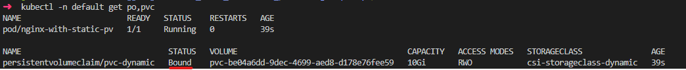
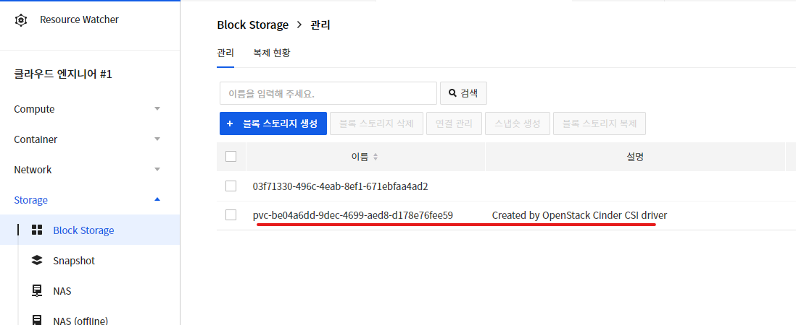

# 개요
* 동적 프로비저닝 예제

# 실행방법
* 쿠버네티스 리소스 배포
```shell
kubectl apply -f ./
```

* 약 10초 기다린 후, pod, pvc상태 확인
```shell
kubectl -n default get po,pvc
```




* NHN cloud에서 스토리지가 생성되었는지 확인



# 삭제
```shell
kubectl delete -f ./
```