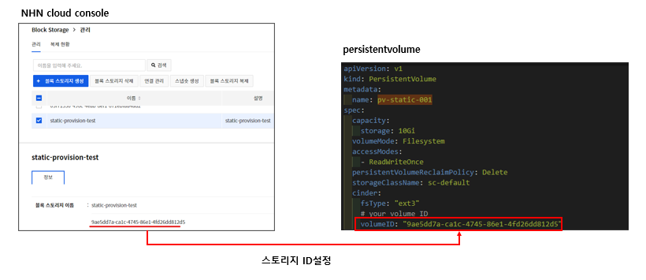
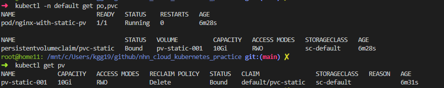

# 개요
* 정적 프로비저닝 예제

# 전제조건
* NHN 스토리지 생성


# 예제 실행
* NHN 스토리지 ID를 persistentvolume에 설정



* 실행
```shell
kubectl apply -f ./
```

* pod, pvc, pv상태 확인
```shell
kubectl -n default get po,pvc
kubectl get pv
```




# 예제 삭제
```shell
kubectl delete -f ./
```
